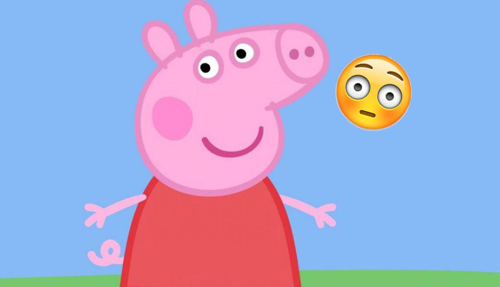

# biodiversidad-y-corporaciones
---
title: "Titulo"
always_allow_html: yes
author:
- Autor$^1$
- Autor$^1$
date: "Mayo 2019"
output: 
  beamer_presentation:
    theme: classic
institute:
- EII$^1$
subtitle: Detalle
header-includes:
- \usepackage{pgf,tikz}
- \usetikzlibrary{patterns}
- \usetikzlibrary{arrows}
- \usepackage{pgfplots}
---

# Slide

- Punteo
- Punteo
  - Inversión y tasa de interés
  - Construcción
  - Análisis Política Fiscal: Expansiva/Restrictiva/Financiada

### Lecturas:  
- Dornbush et ali 
  - Cap 2.7 (tasa de interés), 
  - 10.1 (curva IS) 
  - 11.2 (pol. fiscal)

# Consumo y DA

Sean $\overline{C}>0,\quad c\in(0,1)$,  
$$C(Y)=\underbrace{\overline{C}}_\text{Consumo Autónomo}+\underbrace{c}_\text{Propensión Marginal Consumo}Y$$  

---

::: columns

:::: column

{height=70%}\

::::

:::: column

Sistema Cerrado y Privado (Sin Gobierno)  

- $DA=C(Y)+I$ 
- $OA=Y$  
- Equilibrio: $Y=C(Y)+I$

::::

:::

---

# Ahorro

$S\equiv  Y-C(Y)=Y-\overline{C}+cY\Rightarrow S=-\overline{C}+(1-c)Y$  
